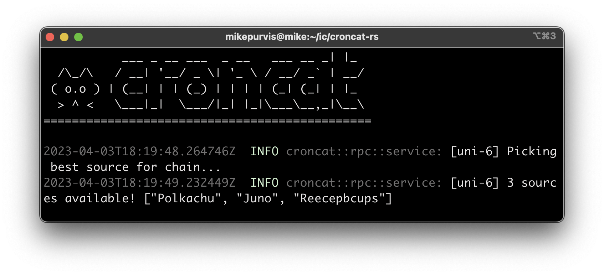

# Cosmos Agents

The agent codebase is a Rust daemon located here:

https://github.com/CronCats/croncat-rs

The application is lightweight enough to run on a small device such as a modern Raspberry Pi. The application has a basic CLI that will be used for setting up an agent, but after that, the application is meant to stay running. Once an agent has registered and been let into the set of "active" agents, it will automatically query the CronCat contracts and fulfill tasks at the appropriate time.

## Agent behavior

When the agent daemon is running it will be doing a few things. The most significant interaction is when the agent fulfills a task. From a high-level, this is like sending in a "blank transaction" with gas. The gas will be used to perform cross-contract calls as described in the CronCat task. The agent is then rewarded with the gas they sent plus an extra percentage. The stored amount is called the reward, and the agent can claim the reward by calling a method. This method will be on the CronCat manager contract and not the agent. This was a deliberate decision. Anyway, the agents withdraws rewards by calling the [manager at `agent_withdraw`](/docs/contracts-manager/#agent_withdraw).

When the agent fulfills a task, it means they've checked that there are tasks to do, and then sends execute messages for the tasks they're on the hook for. **Important**: the agent doesn't know which task they'll execute, just that a task(s) exist that your agent is on the hook for. There are [basic stats](https://docs.rs/croncat-sdk-agents/latest/croncat_sdk_agents/types/struct.AgentStats.html) saved on agent participation, to ensure active agents remain active.

The agent queries the agent contract [at `get_agent_tasks`](/docs/contracts-agents/#get_agent_tasks). This will return the number of "Cron tasks" as well as the number of "Block tasks" which refer to the two categories of tasks we have. (At the time of this writing, and in discussion to explore approaches for future releases.) Let's say the agent queries and hears there are 10 + 9 total tasks to execute, the next step is to call `proxy_call` on the manager contract, which happens automatically with the daemon. (See previous section about `proxy_call` having an optional argument for event-based tasks.)

Another thing an agent daemon does is query its status every few blocks. It checks its status by querying the agent contract at [`get_agent`](/docs/contracts-agents/#get_agent) and providing one parameter `account_id` with the agent's address.

## Launch plan

The CronCat architecture has been built to be fully decentralized on the agents side. For the Cosmos launch, the agents will begin using an internal whitelist held in the [agents smart contract](https://github.com/CronCats/cw-croncat/blob/211b829b3c719c3e7bbfef30c7d637e2ba8ccfaa/contracts/croncat-agents/src/state.rs#L24). After the launch, as the number of tasks grow, the CronCat DAO — who is the sole owner of the CronCat [Factory contract](https://github.com/CronCats/cw-croncat/tree/211b829b3c719c3e7bbfef30c7d637e2ba8ccfaa/contracts/croncat-factory) — will submit a DAO proposal enabling public registration of agents. If the proposal passes, a "one-way" boolean will flip, the agent whitelist will be cleared, and the public will be able to register, as long as they fulfill basic requirements checked on chain.

CronCat is excited to put the team and contributors' full focus on ushering in the advent of blockchain automation. It's a major milestone for everyone in web3, and we know end users, DAOs, and other dApps are excited to begin creating tasks and improving their workflows and user experience.
